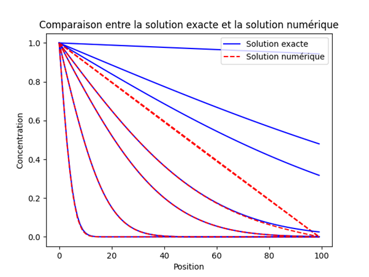
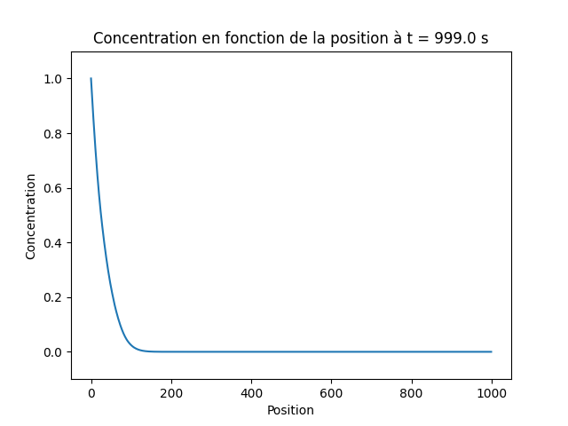

# Auteurs : 
Alison Da Silva, Florio Avenel

# Objectif :  
Programme de resolution d'une equation de diffusion par une methode de différence finie(schéma Euler explicite en temps et centré en espace)

## Équation différentielle de diffusion

Pour déterminer le champ de concentration $C$ à un instant $t_{f}$ dans un milieu diffusif le long d'un domaine de longueur $L$ suivant la direction $x$, on est amené à résoudre l'équation différentielle suivante (terme d'advection négligé) :

$$\frac{\partial C(x,t)}{\partial t} = D \frac{\partial^2 C(x,t)}{\partial x^2}$$

## Condition initiale

La condition initiale à $t=0$ est $C(x, 0)=C_{\text {init }}(x)$ telle que :

$$
C_{\text {init }}(x)=C_{0} \times\left(H\left(x-x_{d}\right)-H\left(x-x_{f}\right)\right)
$$

où $C_{0}$ est la concentration du polluant lors de l'injection dans le domaine, $x_{d}$ et $x_{f}$ sont les positions de début et de fin de la zone de pollution $(0 \leq x_{d} < x_{f} \leq L)$ et $H(x)$ est la fonction d'Heaviside telle que $H(x \geq 0)=1$ et $H(x<0)=0$.

## Conditions aux limites


Les conditions limites en $x=0$ et $x=L$ sont des conditions de Dirichlet, à savoir $C(0, t)=f_1(t)$ et $C(L, t)=f_2(t)$ avec $t \geq 0$ où $f_1$ et $f_2$ sont des fonctions du temps qui seront précisées par la suite. La solution numérique de ce problème est obtenue en utilisant la méthode des différences finies. Pour cela, le domaine physique de longueur $L$ et de direction $x$ est discrétisé en $N$ segments de longueur $\Delta x$, ce dernier étant appelé le pas d'espace. Ici, les $N$ points $x_{k}$ de calcul seront numérotés de $k=0$ à $k=N-1$ depuis $x_{0}=0$ jusqu'à $x_{N-1}=L$. Les solutions en temps sont calculées tous les $\Delta t$ depuis $t=0$ jusqu'à $t_{f}=N_{t} \Delta t$ avec $\Delta t$ appelé le pas de temps et $N_{t}$ est le nombre total de pas de temps.

## Schéma numérique

En utilisant un schéma Euler explicite en temps et centré en espace, on obtient la solution en $t+\Delta t$ en fonction de celle en $t$ via :

$$
\begin{array}{ll}
\left.C\left(x_{k}, t+\Delta t\right)=R C\left(x_{k}-\Delta x, t\right)+(1-2 R) C\left(x_{k}, t\right)+R C\left(x_{k}+\Delta x, t\right) \quad \text { pour } k \in\right] 0, N[, \\
C\left(x_{0}, t+\Delta t\right)=f_1(t+\Delta t) & \text { pour } k=0, \\
C\left(x_{N}, t+\Delta t\right)=f_2(t+\Delta t) & \text { pour } k=N,
\end{array}
$$

avec $R=D \Delta t / \Delta x^{2}$, un nombre sans dimension appelé par la suite «nombre de Fourier ».

# Validation du programme

Ici une solution exacte du problème existe dans le cas d'un milieu semi-infini $(0 \leq x<\infty)$, avec par exemple comme condition initiale à $t=0: C(x, 0)=0$ pour tout $0 \leq x<\infty$ et comme condition limite en $x=0: C(0, t)=C_{x 0}$ pour $t>0$. La solution est donnée par l'équation (9) :

$$
\frac{C(x, t)}{C_{x 0}} = 1 -  \text{erf} \left (\frac{x}{2 \sqrt{D t}}\right) \quad \text { avec } \quad \text{erf} (x)=\frac{2}{\sqrt{\pi}} \int_{0}^{x} \exp \left(-t^{2}\right) d t
$$

où $C_{x 0}$ est la concentration imposée en $x=0$ du polluant et $D$ est un coefficient de diffusion (en $\mathrm{m}^{2} / \mathrm{s}$ ).

Différence entre la solution exacte et la solution numérique à différent temps:


Le temps de la dispersion étudié ne doit pas être trop important pour éviter de trouver des solutions influencées par les conditions aux limites.
De plus pour un nombre trop faible de pas d'espace la solution ne sera pas assez précise pour et une différence entre la solution exacte et la solution numérique se formera.

Pour ce schéma numérique la valeur de R doit être inférieur à 0,5 dans le cas contraire la solution sera instable.


# Fichier d'entrée:   
Le fichier d'entrée est un fichier texte qui sera selectionner dans le programme si le module tkinter
est installé, sinon il faut le mettre dans le répertoire du programme
avec le nom "input.txt"
le fichier doit être de la forme:
```
C_0=
L=
x_d=
x_f=
D=
N_x=
t_fin=
N_t=
boundary_0=
boundary_L=
```

les fonctions dans les deux conditions aux limites peuvent contenir: pi, cos, sin, exp, t, *, +, -, /

# Fichiers résultats :
Création de graphique:      
    
images et vidéos stocké dans le dossier output dans le répertoire du programme


# Pour exécuter le programme : 
Afin d'exécuter le programme il faut utiliser la commande `python3 main.py` ou `python main.py`

# Module python aditionnel 
+ module nécessaire : numpy, matplotlib, os, sys, math, subprocess
+ module optionnel : concurrent futures, functools, tkinter